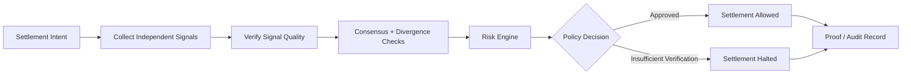

# 🛡️ VeriSettle

[](https://github.com/aryanshah012/VeriSettle-Autonomous-Verified-Settlement-Risk-Agent/actions/workflows/ci.yml)

### Verified Intelligence Before Value Moves

VeriSettle is an **autonomous verified settlement risk agent** built for the Telegraph Protocol hackathon. It gathers independent signals, checks consensus and risk, and only allows settlement when verification requirements are satisfied.

> Core policy: **No verified intelligence → no settlement.**

## ⚡ Problem

Cross-border crypto-to-fiat settlement can depend on fragmented price feeds, opaque counterparty risk signals, stale FX data, and unverifiable decision logic. That makes it difficult to explain why a settlement was allowed or blocked.

## 🚀 Solution

VeriSettle creates a verification layer before value movement. It combines multiple independent signals, evaluates disagreement, applies deterministic risk policies, and produces an auditable decision trail.

## 🧠 Intelligence Quorum

VeriSettle evaluates six signal categories:

- Crypto price
- FX rate
- Wallet / solvency signal
- Fraud signal
- Gas / network conditions
- News / market intelligence

## 🔁 Decision Flow



## 🛡️ Safety Model

- Live Mode does not silently substitute synthetic verification.
- Missing or failed verification blocks settlement.
- Divergent intelligence is surfaced instead of hidden.
- Risk scoring is explainable and separated from settlement execution.
- Decision evidence is preserved for auditability.

## ✨ Key Features

- Multi-signal intelligence quorum
- Weighted consensus and divergence detection
- Explainable composite risk scoring
- Human-readable decision reasoning
- Settlement halt on insufficient verification
- Cryptographic proof / audit bundle
- Attack demo for manipulated or conflicting signals
- Real-time pipeline and telemetry UI

## 🛠️ Tech Stack

| Area | Technology |
|---|---|
| Frontend | Next.js, React, TypeScript |
| Verification | Telegraph Protocol |
| Chain / Settlement Context | Solana Devnet |
| AI Risk Reasoning | Groq-backed intelligence signal |
| Data / App Layer | Prisma / application APIs |
| Proofs | SHA-256 based audit evidence |

## 🚀 Quick Start

```bash
git clone https://github.com/aryanshah012/VeriSettle-Autonomous-Verified-Settlement-Risk-Agent.git
cd VeriSettle-Autonomous-Verified-Settlement-Risk-Agent
npm install
cp .env.example .env
npm run dev
```

Then open `http://localhost:3000`.

## 🎬 Demo Paths

1. **Verified settlement** — valid signals reach consensus and the policy permits continuation.
2. **Attack / divergence demo** — conflicting intelligence is detected and surfaced.
3. **Verification unavailable** — settlement is blocked rather than falling back silently.
4. **Proof inspection** — review the evidence used to reach the final decision.

## 🏆 Hackathon Focus

VeriSettle is designed around a simple principle: external intelligence should be **independently verified before it is trusted for value movement**. The project emphasizes Telegraph-native verification, visible decision logic, and safe failure behavior.

---
Built for the **Telegraph Protocol Hackathon — Track 3: Applications**.

## Engineering Standards

- Automated CI validates changes on pushes and pull requests.
- Dependabot monitors Python and/or JavaScript dependencies where applicable.
- [CONTRIBUTING.md](CONTRIBUTING.md) documents the development workflow and review expectations.
- [SECURITY.md](SECURITY.md) documents responsible vulnerability reporting and security principles.
